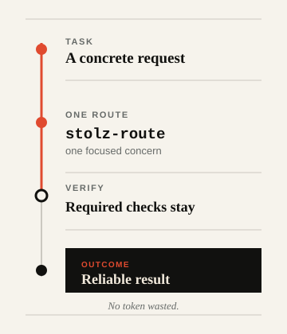

<div align="center">
  <h1><picture>
    <source media="(prefers-color-scheme: dark)" srcset="assets/logo-lockup-dark.svg">
    
  </picture></h1>
  <p><strong>Rational skills for Codex and compatible AI coding agents.</strong></p>
  <p><em>No token wasted.</em></p>
  <p>
    <a href="README.md">English</a> ·
    <a href="docs/README.ru.md">Русский</a> ·
    <a href="docs/README.nl.md">Nederlands</a> ·
    <a href="docs/README.zh.md">中文</a> ·
    <a href="docs/README.he.md">עברית</a>
  </p>
  <p>
    <a href="https://github.com/Sergey360/stolz-ai/actions/workflows/ci.yml"></a>
    <a href="https://github.com/Sergey360/stolz-ai/releases/latest"></a>
    <a href="LICENSE"></a>
  </p>
</div>

**STOLZ A.I.** keeps agent work focused: choose the smallest sufficient route,
load context only when needed, reuse verified results, and keep unchanged state
outside the model.

It does not make a model think less. It helps it waste less—without replacing
correctness, verification, or reliability with a cheaper shortcut.

## Andrei Ivanovich. Artificial intelligence.

The name refers to Andrei Ivanovich Stolz, the rational and active counterpoint
to Oblomov in Ivan Goncharov's novel. `A.I.` carries both meanings: the
character's initials and artificial intelligence.

## What stays under control

- **Five focused skills.** One concern at a time, not a catch-all prompt.
- **Verified reuse.** Reuse requires matching, fresh identities and prior
  verification.
- **Safe fallbacks.** A missing capability never weakens the required outcome
  or checks.

## One task. One route. Verified.

<picture>
  <source media="(prefers-color-scheme: dark)" srcset="assets/route-flow-dark.svg">
  
</picture>

`stolz-route` chooses one focused concern—context, reuse, quiet state, or
benchmarking. Every route keeps the required verification before the outcome.

## The five core skills

### `stolz-route` — choose a route

Use it when an optimization route is needed. It selects the smallest sufficient
route and preserves the safe fallback.

### `stolz-context` — validate context before reading

Use it when a route manifest must be validated before reads. It loads immutable,
route-required context and records identities.

### `stolz-reuse` — reuse verified results only

Use it when a read, command, tool call, or result may repeat. It reuses only
verified, identity-matched results; otherwise it runs and verifies once.

### `stolz-quiet-state` — report meaningful changes

Use it while polling, retrying, following cursors, or handling an asynchronous
handoff. It surfaces material transitions only, keeping unchanged state out of
model narration.

### `stolz-benchmark` — compare equivalent routes

Use it to evaluate a proposed efficiency improvement. It accepts a comparison
only after equivalent outcome and verification gates pass.

## Quick start

Clone a tagged or reviewed revision, then validate it before copying the skill
you need into your agent runtime's skills directory.

```bash
git clone https://github.com/Sergey360/stolz-ai.git
cd stolz-ai
npm ci
npm test

# Example: install the routing skill into a runtime-managed skills directory.
mkdir -p /path/to/agent-skills
cp -R skills/stolz-route /path/to/agent-skills/stolz-route
```

The documented validation surface is deliberately small:

```bash
npm test
npm run build
```

For deterministic profile selection, dry-run/install commands, lazy-loading
rules, and removal, read [Installation and compatibility](docs/INSTALLATION.md).

## Compatibility without overclaiming

The core skills and contracts are provider-neutral: another runtime can use
them when it preserves the required verification behavior. Portability is not
runtime-adapter certification.

The v0.3 line includes C0/C1-certified adapters and isolated profiles for
`codex-local`, Claude Code, and Qwen Code. Each profile installs exactly the
five shared skills and resolves its adapter lazily. Anthropic API, Alibaba
Model Studio, and Z.ai records are declarative provider overlays; they do not
prove a provider call, provider-native telemetry, billing, or token savings.

**C0/C1 supported; C2/C3 withheld/unavailable.** Read the [runtime and
provider capability matrix](docs/RUNTIME_PROVIDER_CAPABILITY_MATRIX.md) for
the exact evidence boundary. A missing or insufficient capability must select
a safe fallback; it must never silently lower the outcome or verification
requirements.

## Evidence boundary

STOLZ A.I. documents mechanisms that can reduce waste, not a numerical saving
claim. A published token-saving statement needs reproducible paired
baseline/optimized evidence on the same versioned fixture, equivalent required
outcomes, and passing verification for both routes. A lower-token run with a
weaker outcome or failed verification is rejected—not counted as a saving.

The checked-in [context-selection v2 report](benchmarks/v2/reports/context-selection-v2.md)
is an accepted, reproducible `fixture_only` result using authored synthetic
token units. It is neither runtime-measured telemetry nor a provider-native,
provider-wide claim. See [benchmark evidence interpretation](docs/INSTALLATION.md#interpreting-benchmark-evidence)
and `skills/stolz-benchmark/` for the admission rules.

## Documentation

- [Installation and compatibility](docs/INSTALLATION.md)
- [Русский README](docs/README.ru.md)
- [Nederlands README](docs/README.nl.md)
- [中文 README](docs/README.zh.md)
- [עברית README](docs/README.he.md)
- [Contributing](CONTRIBUTING.md)
- [Security policy](SECURITY.md)
- [Release notes](CHANGELOG.md) and [release-note template](docs/RELEASE_NOTES_TEMPLATE.md)
- [License](LICENSE) and [project notice](NOTICE)

## Contributing

```bash
npm test
npm run build
npm run benchmark:check
```

Read [Contributing](CONTRIBUTING.md) before opening a change. License and legal
notices are in [LICENSE](LICENSE) and [NOTICE](NOTICE).
