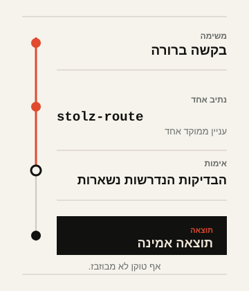

<div align="center">
  <h1><picture>
    <source media="(prefers-color-scheme: dark)" srcset="../assets/logo-lockup-dark.svg">
    
  </picture></h1>
  <p><strong>Skills רציונליות עבור Codex וסוכני קידוד תואמים מבוססי AI.</strong></p>
  <p><em>No token wasted.</em></p>
  <p>
    <a href="../README.md">English</a> ·
    <a href="README.ru.md">Русский</a> ·
    <a href="README.nl.md">Nederlands</a> ·
    <a href="README.zh.md">中文</a> ·
    <a href="README.he.md">עברית</a>
  </p>
  <p>
    <a href="https://github.com/Sergey360/stolz-ai/actions/workflows/ci.yml"></a>
    <a href="https://github.com/Sergey360/stolz-ai/releases/latest"></a>
    <a href="../LICENSE"></a>
  </p>
</div>

STOLZ A.I. היא חבילת Skills ממוקדת לעבודה ממושמעת עם הקשר וכלים. היא עוזרת
לסוכן לבחור את הנתיב הקטן והמספיק ביותר, לטעון מקורות בדיוק בזמן, לעשות שימוש
חוזר רק בתוצאות שאומתו, ולהשאיר מצב שלא השתנה מחוץ למודל.

היא אינה גורמת למודל לחשוב פחות. היא עוזרת לו לבזבז פחות — בלי להחליף נכונות,
אימות או אמינות בקיצור דרך זול יותר.

## במבט אחד

- **חמש Skills ממוקדות.** עניין אחד בכל פעם, לא prompt כללי לכל מצב.
- **שימוש חוזר מאומת.** נדרשות זהויות תואמות ועדכניות ואימות קודם.
- **Fallback בטוח.** יכולת חסרה אינה מחלישה את דרישות התוצאה או הבדיקות.

## משימה אחת. נתיב אחד. אימות.

<picture>
  <source media="(prefers-color-scheme: dark)" srcset="../assets/route-flow-he-dark.svg">
  
</picture>

כאשר המשימה דורשת זאת, `stolz-route` בוחרת רק אחד מהנתיבים הצרים שלמעלה. התרשים
מציג נתיבים אפשריים; הוא אינו הוראה לטעון הכול.

## חמש Skills הליבה

### `stolz-route` — בחירת נתיב

השתמשו בה כשיש לבחור נתיב אופטימיזציה. היא בוחרת נתיב קטן ומספיק ושומרת על
fallback בטוח.

### `stolz-context` — אימות הקשר לפני קריאה

השתמשו בה כשיש לאמת manifest של נתיב לפני קריאה. היא טוענת הקשר בלתי משתנה
הנדרש לנתיב ומתעדת זהויות.

### `stolz-reuse` — שימוש חוזר בתוצאות מאומתות בלבד

השתמשו בה כשקריאה, פקודה, קריאת כלי או תוצאה עשויות לחזור. היא משתמשת שוב רק
בתוצאות מאומתות ובעלות זהות תואמת; אחרת מריצה ומאמתת פעם אחת.

### `stolz-quiet-state` — דיווח על שינויים מהותיים בלבד

השתמשו בה בעת polling, ניסיון חוזר, מעקב אחר cursor או handoff אסינכרוני. היא
מציגה רק מעברים מהותיים; מצב ללא שינוי אינו יוצר נרטיב למודל.

### `stolz-benchmark` — השוואת נתיבים שקולים

השתמשו בה לבחינת שיפור יעילות מוצע. היא מקבלת השוואה רק לאחר תוצאה שקולה
ומעברי שערי אימות.

## התחלה מהירה

שכפלו גרסה מתויגת או שנבדקה. אמתו אותה תחילה, ורק אז העתיקו את ה-Skill הנדרשת
לספריית ה-Skills של סביבת הסוכן.

```bash
git clone https://github.com/Sergey360/stolz-ai.git
cd stolz-ai
npm ci
npm test

# דוגמה: התקנת Skill הניתוב בספריית Skills שמנוהלת על ידי סביבת זמן הריצה.
mkdir -p /path/to/agent-skills
cp -R skills/stolz-route /path/to/agent-skills/stolz-route
```

משטח האימות המתועד נשאר בכוונה קטן:

```bash
npm test
npm run build
```

לבחירת פרופיל דטרמיניסטית, פקודות dry-run/install, טעינה עצלה והסרה, ראו
[Installation and compatibility](INSTALLATION.md).

## תאימות בלי הבטחות יתר

Skills הליבה והחוזים אינם תלויי ספק: סביבת זמן ריצה אחרת יכולה להשתמש בהם אם היא
משמרת את התנהגות האימות הנדרשת. ניידות אינה הסמכת מתאם של סביבת זמן הריצה.

סדרת v0.3 כוללת מתאמים מוסמכי C0/C1 ופרופילים מבודדים עבור `codex-local`,
Claude Code ו-Qwen Code. כל פרופיל מתקין בדיוק את אותן חמש Skills ליבה ופותר
את המתאם שלו בטעינה עצלה. הרשומות עבור Anthropic API, Alibaba Model Studio
ו-Z.ai הן שכבות-על הצהרתיות של ספקים; הן אינן מוכיחות קריאת ספק, טלמטריה
מקורית של ספק, חיוב או חיסכון בטוקנים.

**C0/C1 supported; C2/C3 withheld/unavailable.** לגבול הראיות המדויק, ראו את
[מטריצת יכולות סביבות זמן ריצה וספקים](RUNTIME_PROVIDER_CAPABILITY_MATRIX.md).
יכולת חסרה או לא מספקת חייבת לבחור fallback בטוח ולעולם אינה רשאית להנמיך
בשקט את דרישות התוצאה או האימות.

## גבול הראיות

STOLZ A.I. מתעדת מנגנונים שיכולים לצמצם בזבוז, ולא טענה מספרית לחיסכון. טענה
פומבית לחיסכון בטוקנים דורשת ראיות מזווגות, ניתנות לשחזור, של baseline/optimized
על אותו fixture עם גרסה, תוצאות נדרשות שקולות ואימות מוצלח לשני הנתיבים. ריצה
עם פחות טוקנים אך תוצאה חלשה יותר או אימות שנכשל נדחית — היא אינה נחשבת לחיסכון.

[דוח context-selection v2](../benchmarks/v2/reports/context-selection-v2.md) הכלול
הוא תוצאת `fixture_only` שהתקבלה וניתנת לשחזור, תוך שימוש ביחידות טוקנים
סינתטיות שנכתבו מראש. הוא אינו טלמטריה שנמדדה בזמן ריצה ואינו טענה מקורית של
ספק שאפשר להכליל. לכללי הקבלה ראו [benchmark evidence interpretation](INSTALLATION.md#interpreting-benchmark-evidence)
ו-`../skills/stolz-benchmark/`.

## תיעוד

- [Installation and compatibility](INSTALLATION.md)
- [English README](../README.md)
- [Русский README](README.ru.md)
- [Nederlands README](README.nl.md)
- [中文 README](README.zh.md)
- [Contributing](../CONTRIBUTING.md)
- [Security policy](../SECURITY.md)
- [Release notes](../CHANGELOG.md) ו-[release-note template](RELEASE_NOTES_TEMPLATE.md)
- [רישיון](../LICENSE) ו-[project notice](../NOTICE)

## תרומה לפרויקט

```bash
npm test
npm run build
npm run benchmark:check
```

לפני פתיחת שינוי, קראו את [Contributing](../CONTRIBUTING.md). הרישיון וההודעות
המשפטיות נמצאים ב-[LICENSE](../LICENSE) וב-[NOTICE](../NOTICE).
