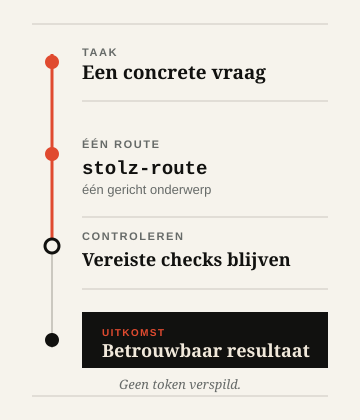

<div align="center">
  <h1><picture>
    <source media="(prefers-color-scheme: dark)" srcset="../assets/logo-lockup-dark.svg">
    
  </picture></h1>
  <p><strong>Rationele skills voor Codex en compatibele AI-codeeragenten.</strong></p>
  <p><em>No token wasted.</em></p>
  <p>
    <a href="../README.md">English</a> ·
    <a href="README.ru.md">Русский</a> ·
    <a href="README.nl.md">Nederlands</a> ·
    <a href="README.zh.md">中文</a> ·
    <a href="README.he.md">עברית</a>
  </p>
  <p>
    <a href="https://github.com/Sergey360/stolz-ai/actions/workflows/ci.yml"></a>
    <a href="https://github.com/Sergey360/stolz-ai/releases/latest"></a>
    <a href="../LICENSE"></a>
  </p>
</div>

STOLZ A.I. is een gerichte skill-suite voor gedisciplineerd werken met context
en tools. De suite helpt een agent de kleinste toereikende route te kiezen,
referenties precies op tijd te laden, alleen geverifieerde resultaten opnieuw
te gebruiken en ongewijzigde status buiten het model te houden.

Ze laat een model niet minder denken. Ze helpt verspilling te beperken, zonder
correctheid, verificatie of betrouwbaarheid in te ruilen voor een goedkopere
snelkoppeling.

## In één oogopslag

- **Vijf gerichte skills.** Eén onderwerp tegelijk, geen algemene prompt voor
  alles.
- **Geverifieerd hergebruik.** Hergebruik vereist overeenkomende, actuele
  identiteiten en eerdere verificatie.
- **Veilige fallback.** Een ontbrekende capability verzwakt nooit de vereiste
  uitkomst of controles.

## Eén taak. Eén route. Geverifieerd.

<picture>
  <source media="(prefers-color-scheme: dark)" srcset="../assets/route-flow-nl-dark.svg">
  
</picture>

`stolz-route` selecteert één van deze smalle routes wanneer de taak dat nodig
heeft. Het diagram toont mogelijke paden; het is geen instructie om alles te
laden.

## De vijf kernskills

### `stolz-route` — kies een route

Gebruik deze skill wanneer je een optimalisatieroute moet kiezen. Hij kiest de
kleinste toereikende route en bewaart de veilige fallback.

### `stolz-context` — valideer context vóór het lezen

Gebruik deze skill wanneer een routemanifest vóór het lezen moet worden
gevalideerd. Hij laadt onveranderlijke, voor de route vereiste context en
registreert identiteiten.

### `stolz-reuse` — hergebruik alleen geverifieerde resultaten

Gebruik deze skill wanneer een read, command, tool call of resultaat kan
terugkomen. Hij hergebruikt uitsluitend geverifieerde resultaten met passende
identiteit; anders voert hij één keer uit en verifieert hij één keer.

### `stolz-quiet-state` — meld alleen betekenisvolle wijzigingen

Gebruik deze skill bij polling, opnieuw proberen, cursors volgen of een async
handoff. Hij toont alleen materiële overgangen; ongewijzigde status wordt geen
modelnarratief.

### `stolz-benchmark` — vergelijk gelijkwaardige routes

Gebruik deze skill om een voorgestelde efficiëntieverbetering te beoordelen.
Hij accepteert een vergelijking pas na een gelijkwaardige uitkomst en geslaagde
verificatiegates.

## Snel beginnen

Kloon een getagde of beoordeelde revisie. Valideer die eerst en kopieer daarna
alleen de benodigde skill naar de skills-map van je agentruntime.

```bash
git clone https://github.com/Sergey360/stolz-ai.git
cd stolz-ai
npm ci
npm test

# Voorbeeld: installeer de routing-skill in een runtimebeheerde skills-map.
mkdir -p /path/to/agent-skills
cp -R skills/stolz-route /path/to/agent-skills/stolz-route
```

De gedocumenteerde validatie-oppervlakte blijft bewust klein:

```bash
npm test
npm run build
```

Lees [Installation and compatibility](INSTALLATION.md) voor
deterministische profielselectie, dry-run/install-opdrachten, lazy loading en
verwijdering.

## Compatibiliteit zonder te veel te beloven

De kernskills en contracten zijn provider-neutraal: een andere runtime kan ze
gebruiken wanneer die het vereiste verificatiegedrag bewaart. Draagbaarheid is
geen certificering van een runtime-adapter.

De v0.3-lijn bevat C0/C1-gecertificeerde adapters en geïsoleerde profielen voor
`codex-local`, Claude Code en Qwen Code. Elk profiel installeert exact dezelfde
vijf kernskills en lost zijn adapter lazy op. Records voor Anthropic API,
Alibaba Model Studio en Z.ai zijn declaratieve provider-overlays; zij bewijzen
geen provideraanroep, provider-native telemetrie, facturering of tokenbesparing.

**C0/C1 supported; C2/C3 withheld/unavailable.** Raadpleeg de [runtime- en
provider-capabilitymatrix](RUNTIME_PROVIDER_CAPABILITY_MATRIX.md) voor de
precieze evidentiale grens. Een ontbrekende of onvoldoende capability moet een
veilige fallback kiezen en mag de eisen aan uitkomst of verificatie nooit stil
verlagen.

## Evidencegrens

STOLZ A.I. documenteert mechanismen die verspilling kunnen verminderen, geen
numerieke besparingsclaim. Een openbare claim over tokenbesparing vereist
reproduceerbaar gepaard baseline/optimized-bewijs op dezelfde geversioneerde
fixture, equivalente vereiste uitkomsten en geslaagde verificatie voor beide
routes. Een run met minder tokens maar een zwakkere uitkomst of mislukte
verificatie wordt afgewezen—niet als besparing geteld.

Het meegeleverde [context-selection v2-rapport](../benchmarks/v2/reports/context-selection-v2.md)
is een geaccepteerd, reproduceerbaar `fixture_only`-resultaat met gecreëerde
synthetische tokenunits. Het is geen runtime-gemeten telemetrie en geen
provider-native, providerbrede claim. Zie [benchmark evidence interpretation](INSTALLATION.md#interpreting-benchmark-evidence)
en `../skills/stolz-benchmark/` voor de toelatingsregels.

## Documentatie

- [Installation and compatibility](INSTALLATION.md)
- [English README](../README.md)
- [Русский README](README.ru.md)
- [中文 README](README.zh.md)
- [עברית README](README.he.md)
- [Contributing](../CONTRIBUTING.md)
- [Security policy](../SECURITY.md)
- [Release notes](../CHANGELOG.md) en [release-note template](RELEASE_NOTES_TEMPLATE.md)
- [Licentie](../LICENSE) en [project notice](../NOTICE)

## Bijdragen

```bash
npm test
npm run build
npm run benchmark:check
```

Lees [Contributing](../CONTRIBUTING.md) voordat je een wijziging opent. De
licentie en juridische kennisgevingen staan in [LICENSE](../LICENSE) en
[NOTICE](../NOTICE).
