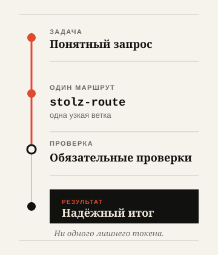

<div align="center">
  <h1><picture>
    <source media="(prefers-color-scheme: dark)" srcset="../assets/logo-lockup-ru-dark.svg">
    
  </picture></h1>
  <p><strong>Рациональные навыки для Codex и совместимых AI-агентов.</strong></p>
  <p><em>Ни одного лишнего токена.</em></p>
  <p>
    <a href="../README.md">English</a> ·
    <a href="README.ru.md">Русский</a> ·
    <a href="README.nl.md">Nederlands</a> ·
    <a href="README.zh.md">中文</a> ·
    <a href="README.he.md">עברית</a>
  </p>
  <p>
    <a href="https://github.com/Sergey360/stolz-ai/actions/workflows/ci.yml"></a>
    <a href="https://github.com/Sergey360/stolz-ai/releases/latest"></a>
    <a href="../LICENSE"></a>
  </p>
</div>

**Штольц А.И.** помогает AI-агенту выбрать минимально достаточный маршрут,
загрузить контекст в нужный момент, повторно использовать проверенный результат
и не заполнять контекст модели неизменными данными.

Он не заставляет модель думать меньше. Он помогает ей не тратить лишнего —
без подмены качества, проверки и надёжности дешёвым сокращением пути.

## Андрей Иванович. Искусственный интеллект.

Название отсылает к Андрею Ивановичу Штольцу — рациональному и деятельному
герою романа Ивана Гончарова «Обломов». «А.И.» читается сразу в двух смыслах:
инициалы героя и искусственный интеллект.

## Что остаётся под контролем

- **Пять узких навыков.** Одна задача за раз, а не общий промпт на все случаи.
- **Только проверенное повторное использование.** Нужны совпадающие,
  актуальные идентичности и предыдущая проверка.
- **Безопасный откат.** Недостающая возможность не ослабляет требуемый
  результат и проверки.

## Одна задача. Один маршрут. Проверка.

<picture>
  <source media="(prefers-color-scheme: dark)" srcset="../assets/route-flow-ru-dark.svg">
  
</picture>

`stolz-route` выбирает одно направление: контекст, повторное использование,
тихое состояние или бенчмарк. Любой маршрут сохраняет обязательную проверку
перед результатом.

## Пять основных навыков

### `stolz-route` — выбрать маршрут

Нужен, когда требуется выбрать маршрут оптимизации. Выбирает минимально
достаточный маршрут и сохраняет безопасный откат.

### `stolz-context` — проверить контекст до чтения

Нужен, когда перед чтением необходимо проверить манифест маршрута. Загружает
неизменяемый, необходимый маршруту контекст и фиксирует идентичности.

### `stolz-reuse` — повторно использовать только проверенное

Нужен, когда могут повториться чтение, команда, вызов инструмента или результат.
Повторно использует только проверенные результаты с совпадающей идентичностью;
иначе запускает и проверяет один раз.

### `stolz-quiet-state` — сообщать о значимых изменениях

Нужен при опросе состояния, повторной попытке, работе с курсором или
асинхронной передаче. Показывает только существенные изменения и не создаёт
сообщений модели о неизменном состоянии.

### `stolz-benchmark` — сравнивать эквивалентные маршруты

Нужен для оценки предложенного улучшения эффективности. Принимает сравнение
только после эквивалентного результата и прохождения проверок.

## Быстрый старт

Клонируйте помеченную тегом или проверенную ревизию, подтвердите её
корректность и только затем скопируйте нужный навык в каталог навыков вашего
агента.

```bash
git clone https://github.com/Sergey360/stolz-ai.git
cd stolz-ai
npm ci
npm test

# Пример: установить навык маршрутизации в каталог навыков среды выполнения.
mkdir -p /path/to/agent-skills
cp -R skills/stolz-route /path/to/agent-skills/stolz-route
```

Поверхность проверки намеренно невелика:

```bash
npm test
npm run build
```

Детерминированный выбор профиля, команды пробного/реального запуска,
ленивую загрузку и удаление описывает [инструкция по установке и
совместимости](INSTALLATION.md).

## Совместимость без лишних обещаний

Основные навыки и контракты не зависят от провайдера: другая среда выполнения
может применять их, если сохраняет требуемое поведение проверки. Переносимость
не означает сертификацию адаптера среды выполнения.

В линейке v0.3 C0/C1-сертифицированы адаптеры и изолированные профили
для `codex-local`, Claude Code и Qwen Code. Каждый профиль устанавливает ровно
пять общих навыков и лениво разрешает свой адаптер. Записи для Anthropic API,
Alibaba Model Studio и Z.ai — декларативные оверлеи провайдеров: они не
доказывают вызов провайдера, нативную телеметрию провайдера, биллинг или
экономию токенов.

**C0/C1 поддерживаются; C2/C3 удержаны/недоступны.** Точная граница
доказательств приведена в [матрице возможностей сред выполнения и
провайдеров](RUNTIME_PROVIDER_CAPABILITY_MATRIX.md). Если возможности
нет или она недостаточна, должен выбираться безопасный откат; он никогда не
должен молча понижать требования к результату или проверке.

## Граница доказательств

Штольц А.И. описывает механизмы, способные сократить потери, а не заявляет
численный результат. Чтобы опубликовать утверждение об экономии токенов,
нужны воспроизводимые парные данные baseline/optimized для одного
версионированного fixture, эквивалентные обязательные результаты и успешная
проверка обоих маршрутов. Запуск с меньшим числом токенов, но слабым
результатом или неуспешной проверкой отклоняется — это не экономия.

Проверяемый [отчёт context-selection v2](../benchmarks/v2/reports/context-selection-v2.md)
имеет статус `fixture_only` и использует подготовленные синтетические единицы
токенов. Это не телеметрия среды выполнения и не нативные данные провайдера,
которые можно обобщать на всех. Правила допуска описаны в [толковании
бенчмарк-доказательств](INSTALLATION.md#interpreting-benchmark-evidence)
и `../skills/stolz-benchmark/`.

## Документация

- [Installation and compatibility](INSTALLATION.md)
- [English README](../README.md)
- [Nederlands README](README.nl.md)
- [中文 README](README.zh.md)
- [עברית README](README.he.md)
- [Участие в разработке](../CONTRIBUTING.md)
- [Политика безопасности](../SECURITY.md)
- [Заметки к релизам](../CHANGELOG.md) и [шаблон заметки](RELEASE_NOTES_TEMPLATE.md)
- [Лицензия](../LICENSE) и [уведомление проекта](../NOTICE)

## Участие в разработке

```bash
npm test
npm run build
npm run benchmark:check
```

Перед изменениями прочитайте [правила участия](../CONTRIBUTING.md). Лицензия
и юридические сведения собраны в [LICENSE](../LICENSE) и [NOTICE](../NOTICE).
