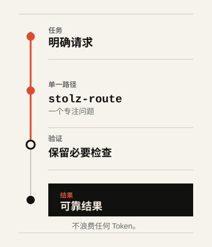

<div align="center">
  <h1><picture>
    <source media="(prefers-color-scheme: dark)" srcset="../assets/logo-lockup-dark.svg">
    
  </picture></h1>
  <p><strong>面向 Codex 与兼容 AI 编程代理的理性技能套件。</strong></p>
  <p><em>No token wasted.</em></p>
  <p>
    <a href="../README.md">English</a> ·
    <a href="README.ru.md">Русский</a> ·
    <a href="README.nl.md">Nederlands</a> ·
    <a href="README.zh.md">中文</a> ·
    <a href="README.he.md">עברית</a>
  </p>
  <p>
    <a href="https://github.com/Sergey360/stolz-ai/actions/workflows/ci.yml"></a>
    <a href="https://github.com/Sergey360/stolz-ai/releases/latest"></a>
    <a href="../LICENSE"></a>
  </p>
</div>

STOLZ A.I. 是一组专注于上下文与工具使用纪律的技能。它帮助代理选择
最小且足够的路径、在恰当时机加载参考资料、只复用已经验证的结果，并将
未变化的状态保留在模型之外。

它不会让模型少思考，而是帮助模型少浪费；不会用廉价的捷径替代正确性、
验证或可靠性。

## 一览

- **五项专注技能。** 一次处理一个问题，而不是无所不包的提示词。
- **经过验证的复用。** 复用需要匹配且仍有效的身份信息，以及此前的验证。
- **安全回退。** 能力缺失绝不会降低对结果或检查的要求。

## 一个任务。一条路径。完成验证。

<picture>
  <source media="(prefers-color-scheme: dark)" srcset="../assets/route-flow-zh-dark.svg">
  
</picture>

当任务需要时，`stolz-route` 只会选择其中一条狭窄路径。图中展示的是可能
的路径，并不要求一次加载全部内容。

## 五项核心技能

### `stolz-route` — 选择路径

需要选择优化路径时使用。它会选择最小且足够的路径，并保留安全回退。

### `stolz-context` — 读取前验证上下文

需要在读取前验证路径清单时使用。它会加载路径所需的不可变上下文，并记录
身份信息。

### `stolz-reuse` — 仅复用已验证结果

读取、命令、工具调用或结果可能重复时使用。它只复用已验证且身份匹配的结果；
否则执行并验证一次。

### `stolz-quiet-state` — 只报告实质变化

轮询、重试、跟踪游标或处理异步交接时使用。它只呈现实质性的状态转换，避免让
未变化的状态产生模型叙述。

### `stolz-benchmark` — 比较等价路径

评估一项效率改进建议时使用。只有在等价结果和验证门槛均通过后，它才会接受
比较。

## 快速开始

克隆带有标签或已审查的修订版本。先完成验证，再将所需技能复制到代理运行时
的技能目录。

```bash
git clone https://github.com/Sergey360/stolz-ai.git
cd stolz-ai
npm ci
npm test

# 示例：将路由技能安装到运行时管理的技能目录。
mkdir -p /path/to/agent-skills
cp -R skills/stolz-route /path/to/agent-skills/stolz-route
```

有意保持精简的验证命令如下：

```bash
npm test
npm run build
```

请阅读 [Installation and compatibility](INSTALLATION.md)，了解确定性的
配置文件选择、试运行/安装命令、延迟加载和卸载方式。

## 不夸大承诺的兼容性

核心技能与契约不依赖于提供商：只要另一个运行时能保留所需的验证行为，就能
使用它们。可移植性并不等同于运行时适配器认证。

v0.3 系列包含面向 `codex-local`、Claude Code 和 Qwen Code 的 C0/C1 认证适配器
与隔离配置文件。每个配置文件都只安装相同的五项核心技能，并延迟解析自己的
适配器。Anthropic API、Alibaba Model Studio 和 Z.ai 的记录是声明式提供商覆盖层；
它们并不能证明已调用提供商、存在提供商原生遥测、计费或 Token 节省。

**C0/C1 supported; C2/C3 withheld/unavailable.** 精确的证据边界请参阅
[运行时和提供商能力矩阵](RUNTIME_PROVIDER_CAPABILITY_MATRIX.md)。如果
能力缺失或不足，必须选择安全回退，绝不能悄然降低结果或验证要求。

## 证据边界

STOLZ A.I. 记录的是可能减少浪费的机制，而不是数值化的节省声明。公开的
Token 节省声明需要：同一版本化 fixture 上可复现的 baseline/optimized 成对证据、
等价的必需结果，以及两条路径都通过验证。Token 更少但结果较弱或验证失败的
运行会被拒绝，而不会被计为节省。

仓库中的 [context-selection v2 报告](../benchmarks/v2/reports/context-selection-v2.md)
是已接受、可复现的 `fixture_only` 结果，使用了编写的合成 Token 单位。它既不是
运行时实测遥测，也不是可泛化到提供商范围的提供商原生声明。准入规则见
[benchmark evidence interpretation](INSTALLATION.md#interpreting-benchmark-evidence)
与 `../skills/stolz-benchmark/`。

## 文档

- [Installation and compatibility](INSTALLATION.md)
- [English README](../README.md)
- [Русский README](README.ru.md)
- [Nederlands README](README.nl.md)
- [עברית README](README.he.md)
- [Contributing](../CONTRIBUTING.md)
- [Security policy](../SECURITY.md)
- [Release notes](../CHANGELOG.md) 和 [release-note template](RELEASE_NOTES_TEMPLATE.md)
- [许可证](../LICENSE) 和 [project notice](../NOTICE)

## 参与贡献

```bash
npm test
npm run build
npm run benchmark:check
```

提交改动前，请阅读 [Contributing](../CONTRIBUTING.md)。许可证和法律声明见
[LICENSE](../LICENSE) 与 [NOTICE](../NOTICE)。
